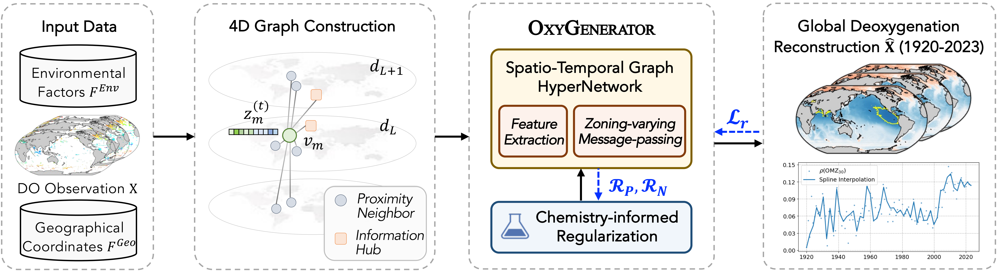

# Oxygenerator

This repository contains the code implementation for the paper *OXYGENERATOR: Reconstructing Global Ocean Deoxygenation Over a Century with Deep Learning*, which explores the reconstruction of global dissolved oxygen levels with sparse observational data.




## Project Structure
```
├── data/               # Directory for storing datasets
├── logging/            # Directory for experiment results
├── model_pkl/          # Directory for result models
├── README.md           # Project documentation
├── models.py           # Model implementation
├── utils.py            # Utility functions
└── main.py             # Training script
```

## Experiment Environment

- python 3.9

- pytorch 2.1+

- torch-geometric 2.4+

## Basic Usage

#### OXYGENERATOR

```
python main.py --hidden_dim 32 --layer_num 2 --epoch 500 --lr 1e-3
```

## Contact

Bin Lu (robinlu1209@sjtu.edu.cn), Ze Zhao (zhaoze@sjtu.edu.cn)
